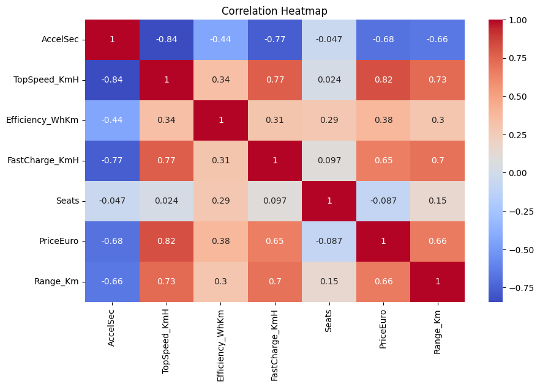
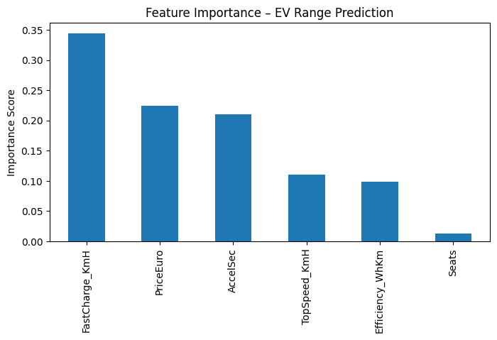
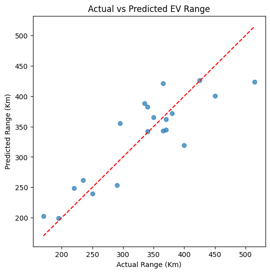

---
# 🔋 Task 02 – Electric Vehicle Range Prediction

**Machine Learning Internship – Future Interns**

<p align="center">
  
  
  
  
  
</p>

---

## 📌 Project Description

This project is **Task-02** of the **Machine Learning Internship at Future Interns**.
The objective is to **predict the driving range of electric vehicles (EVs)** using regression models based on technical specifications such as acceleration, efficiency, charging speed, seating capacity, and price.

The project focuses on applying **supervised learning (regression)** to a real-world **electric vehicle dataset**, aligned with both **machine learning fundamentals** and **automotive/EV domain relevance**.

---

## 🎯 Problem Statement

Electric vehicle range is a critical factor for:

* Consumer decision-making
* Battery performance analysis
* EV design optimization

Using historical EV specification data, we aim to **estimate vehicle range (in km)** through machine learning regression techniques.

---

## 🧠 Machine Learning Workflow

| Step                  | Description                                  |
| --------------------- | -------------------------------------------- |
| 1️⃣ Data Loading      | Imported cleaned EV dataset                  |
| 2️⃣ Data Cleaning     | Handled missing & invalid values             |
| 3️⃣ Feature Selection | Selected performance & cost-related features |
| 4️⃣ EDA               | Correlation analysis & visualization         |
| 5️⃣ Model Training    | Linear Regression & Random Forest            |
| 6️⃣ Evaluation        | R², MAE, RMSE metrics                        |
| 7️⃣ Interpretation    | Feature importance analysis                  |

---

## 🛠️ Technologies Used

| Category     | Tools                              |
| ------------ | ---------------------------------- |
| Programming  | Python                             |
| Libraries    | Pandas, NumPy, Matplotlib, Seaborn |
| ML Framework | Scikit-learn                       |
| Models       | Linear Regression, Random Forest   |
| Platform     | Jupyter Notebook / Google Colab    |

---

## 📊 Dataset Information

* **Source:** Kaggle – Electric Vehicle Specifications
* **Records:** 400+ EV models
* **Target Variable:** `Range_Km`
* **Key Features:**

  * Acceleration (0–100 km/h)
  * Top Speed
  * Energy Efficiency (Wh/km)
  * Fast Charging Speed
  * Seats
  * Price (Euro)

---

## 📈 Model Performance Summary

| Model             | R² Score        | MAE             | RMSE           |
| ----------------- | --------------- | --------------- | -------------- |
| Linear Regression | Moderate        | Higher Error    | Higher RMSE    |
| Random Forest     | **High (Best)** | **Lower Error** | **Lower RMSE** |

✔ **Random Forest Regressor** provided significantly better performance and generalization.

---
## 📊 Visual Analysis & Model Evaluation

### 🔗 Feature Correlation


### ⭐ Feature Importance (Random Forest)


### 📈 Actual vs Predicted EV Range


### ⚡ Efficiency vs Driving Range


---

## 🔍 Key Insights

* **Energy efficiency** and **charging speed** strongly influence EV range
* **Price alone is not a strong predictor** of driving range
* Tree-based models capture **non-linear relationships** better than linear regression
* ML models can assist manufacturers in **battery and performance trade-offs**

---

## 📁 Repository Structure

```
Task_02_EV_Range_Prediction/
│── ElectricCarData_Clean.csv      # Dataset
│── ev_range_prediction.ipynb      # Complete ML notebook
│── predictions.csv               # Model predictions
│── README.md                     # Project documentation
```

---

## 📝 Learnings & Skills Gained

* Regression modeling with real-world data
* Feature importance interpretation
* Model evaluation using multiple metrics
* Applying ML to **EV & battery-related problems**
* End-to-end ML project structuring for GitHub & resume

---

## 🚀 Future Improvements

* Add XGBoost / Gradient Boosting models
* Hyperparameter tuning with GridSearchCV
* Deploy model as a REST API (Flask / FastAPI)
* Build an interactive Power BI dashboard

---

## 👨‍💻 Author

**S. T. Thunhaal**
Machine Learning Intern – Future Interns
LinkedIn: [https://www.linkedin.com/in/thunhaal-st-041001319/](https://www.linkedin.com/in/thunhaal-st-041001319/)

---

